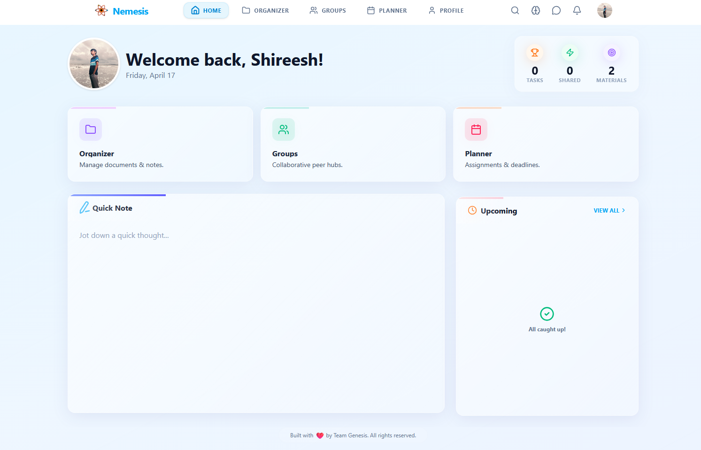
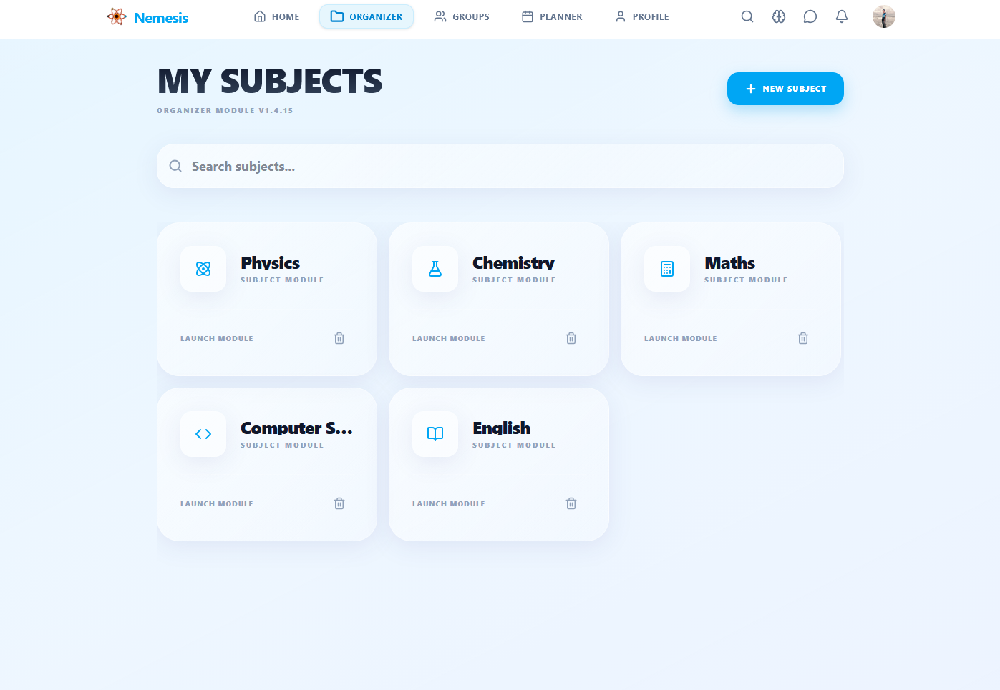
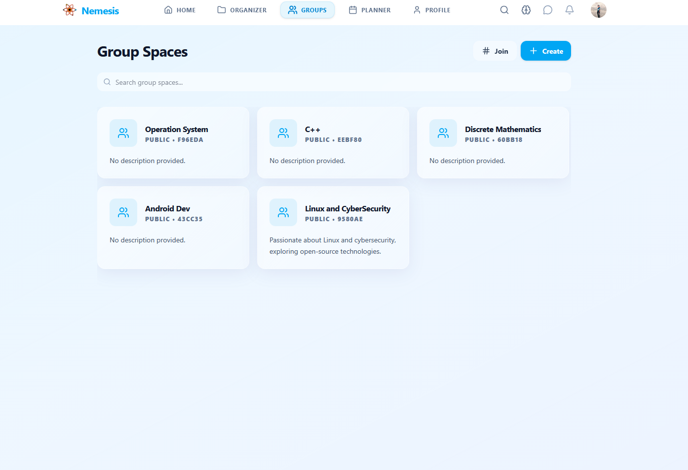
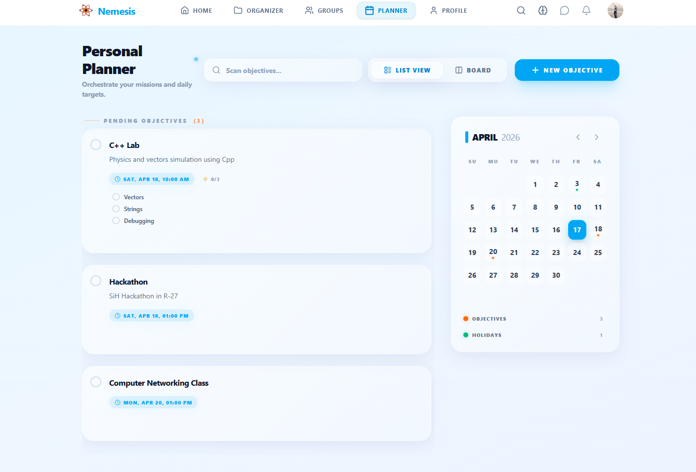

<div align="center">

  

  <h1>NEMESIS</h1>
  <p><strong>Intelligence Protocol Activated</strong></p>

  <p>
    The most advanced academic collaboration and productivity platform,<br/>
    engineered for students who refuse to be ordinary.
  </p>

  <p>
    
    
    
    
    
    
  </p>

  <p>
    <a href="https://nemesiss.in"><strong>🚀 Live Demo</strong></a>
    ·
    <a href="./Nemesis_Official_Documentation.pdf"><strong>📖 Full Documentation</strong></a>
    ·
    <a href="https://github.com/Sh123e5h/Nemesis/issues"><strong>🐛 Report Bug</strong></a>
  </p>

</div>

---

## 🧠 What is Nemesis?

**Nemesis** is a web & mobile app built for students who want more than just a to-do list. It combines **task management**, **study organization**, **real-time group collaboration**, **flashcards with spaced repetition**, a **Pomodoro timer**, a **collaborative whiteboard**, and **gamification** — all in one place.

Named after the Greek goddess who restores balance, Nemesis gives every student the same tools that top teams use at work: real-time chat, shared calendars, Kanban boards, file sharing, and role-based permissions. It runs in your browser as a PWA (offline-capable), and can be packaged as a native Android/iOS app via Capacitor.

Built by **Shireesh Kashyap**, a 19-year-old Computer Science student, from scratch with React, TypeScript, Supabase, and Tailwind CSS.

> *"Nemesis is like sex, it's better when it's free."*

---

## ✨ Features (in detail)

### 📊 01. Dashboard — Your Mission Control

When you log in, the dashboard shows you everything that matters right now:

- **Upcoming tasks** — pulled from your Planner, sorted by due date
- **Recent activity** — what your groups have been up to
- **Quick stats** — tasks completed, files shared, study sessions done
- **Gamification progress** — your level, points, streak, and badges
- **Security notice** — first-time users get a one-time checklist to lock down their account

All wrapped in animated cards with smooth Framer Motion transitions. The dashboard adapts to mobile, tablet, and desktop layouts automatically.

<div align="center">

</div>

---

### 🗂️ 02. Study Organizer

A full-featured file & note manager for your courses:

- **Folder structure** — organize by subject, topic, or semester
- **Smart search** — search across all your materials instantly
- **File uploads** — supports images, PDFs, documents, videos (with automatic HEIC→WebP conversion and video compression)
- **Flashcard decks** — create decks by subject, then study with spaced repetition (SM-2 algorithm)
- **AI quiz generator** — generate practice questions from your study materials
- **Share with groups** — attach materials to group libraries with a click

<div align="center">

</div>

---

### 👥 03. Groups — Real-Time Collaboration

Create or join study groups and get a full collaboration suite:

- **Group Chat** — real-time messaging powered by Supabase Realtime WebSockets. Supports text, file attachments, markdown rendering, and embedded YouTube previews.
- **Shared Planner** — assign tasks to group members with due dates and subtasks.
- **File Library** — a central repository where anyone in the group can upload and download study materials.
- **Collaborative Whiteboard** — a multi-user drawing canvas (powered by Konva.js) where group members can sketch diagrams, write notes, and brainstorm together in real time.
- **Pomodoro Timer** — a shared timer so the whole group can focus together. Supports work/break intervals and syncs across members.

<div align="center">

</div>

---

### 📅 04. Planner — Never Miss a Deadline

A Kanban-style task manager with drag-and-drop:

- **Create tasks** with title, description, due date, and optional subtasks
- **Drag & drop** between status columns (To Do / In Progress / Done)
- **Calendar view** — switch between Kanban board and monthly calendar
- **Group tasks** — assign tasks to your study groups
- **Subtasks** — break big assignments into smaller steps
- **Due date reminders** — syncs with the notification system
- **Connected to dashboard** — upcoming tasks appear on your home screen automatically

<div align="center">

</div>

---

### 🃏 05. Flashcards with Spaced Repetition

Built-in flashcard system using the **SM-2 algorithm** (the same math behind Anki and SuperMemo):

- **Create decks** by subject with a rich card editor (front + back)
- **AI-suggested cards** — the quiz generator can auto-create cards from your notes
- **Spaced repetition** — each card schedules its next review based on how well you remembered it
- **Study session UI** — flip cards, rate yourself (easy / medium / hard), track progress
- **Deck stats** — see card counts, review intervals, and mastery level per deck

---

### ⏱️ 06. Pomodoro Timer

A fully-featured focus timer:

- **Work / Short Break / Long Break** intervals (25 min / 5 min / 15 min by default)
- **Group sync** — when used inside a group, everyone sees the same timer in real time
- **Session history** — tracks how many focus sessions you've completed
- **Draggable UI** — floats over the page so you can use it while working on other screens
- **Notifications** — alerts you when a session ends, even if the page is in the background

---

### 🏆 07. Gamification

A complete progression system that rewards studying:

- **Points** — earn points for completing tasks, uploading files, studying flashcards, and collaborating in groups
- **Badges** — unlock achievements like "First Upload", "Study Streak", "Group Player", "Quiz Master"
- **Levels** — every X points you level up (displayed on your profile and dashboard)
- **Leaderboard** — see how you rank against other students (opt-in)
- **Streak tracking** — consecutive days of activity are tracked and rewarded

---

### 🔔 08. Smart Notifications

Real-time notifications delivered instantly via Supabase Realtime:

- Task reminders (due soon, overdue)
- Group activity (new messages, file uploads, assignments)
- System announcements (from admins)
- Friend requests and group invites
- Notification preferences — choose which types you want to receive

---

### 💬 09. Direct Messages

Private 1-on-1 messaging between any two users:

- Real-time WebSocket chat
- File attachments with smart upload (images, documents, media)
- Markdown rendering in messages
- User search to find who you want to message

---

### 🔍 10. Global Search

Search across the entire platform from one place:

- Search study materials (by title, subject, topic)
- Search groups (by name, description)
- Search users
- Instant results as you type

---

### 🎨 11. Collaborative Whiteboard

A full multi-user drawing canvas for brainstorming and teaching:

- Drawing tools: pencil, square, circle, text, eraser
- Color picker and line width controls
- Real-time sync — everyone in the group sees what you draw instantly
- Infinite canvas with pan & zoom
- Download your whiteboard as an image

---

### 🔐 12. Admin Panel

For users with admin privileges:

- **Dashboard** — platform-wide stats (total users, active groups, file storage usage, online users)
- **User management** — search, view, and manage user accounts
- **Feature flags** — toggle features on/off, set rollout percentages
- **System announcements** — send broadcast messages to all users
- **Storage monitoring** — track Supabase + Cloudflare R2 usage

---

### ⚙️ 13. Settings & Cloud Sync

- **Profile editing** — update name, avatar, username
- **Google Drive sync** — connect your Google account to back up your data to Drive (OAuth2 with offline access)
- **Cloud sync status** — see last sync time, connection status, and quota
- **Restore from cloud** — one-click restore from Drive backup
- **Account security** — password change, session management

---

### 📱 14. Cross-Platform (PWA + Native)

- **PWA** — installable on desktop and mobile, works offline with IndexedDB caching
- **Android/iOS** — uses Capacitor to wrap the web app as a native APK/IPA
- **Responsive design** — optimized for phones, tablets, and desktops
- **Offline-first** — Dexie.js (IndexedDB) stores a local copy of your data, syncs when you reconnect

---

## 🛠️ Technology Stack

| Layer | Technology | What It Does |
|---|---|---|
| **Frontend** | React 19, TypeScript, Vite 5 | UI framework, type safety, fast builds |
| **Animation** | Framer Motion | Page transitions, card animations, micro-interactions |
| **Styling** | Tailwind CSS v4 | Utility-first CSS, responsive design |
| **State Management** | Zustand | Lightweight global state store |
| **Database & Auth** | Supabase (PostgreSQL) | User accounts, RLS, real-time subscriptions |
| **File Storage** | Supabase Storage + Cloudflare R2 | Media uploads (images, docs, videos) |
| **Real-Time** | Supabase Realtime | WebSocket-powered chat, notifications, timer sync |
| **Offline** | Dexie.js (IndexedDB) | Offline data caching and sync engine |
| **Whiteboard** | Konva.js (react-konva) | Multi-user collaborative drawing canvas |
| **Markdown** | react-markdown + remark-gfm | Markdown rendering in messages and notes |
| **Cross-Platform** | Capacitor | Native iOS/Android wrapper |
| **Security** | Row Level Security (RLS), PKCE OAuth | Database-level access control, secure login |
| **Cloud Sync** | Google Drive API (OAuth2) | Backup and restore user data |
| **Testing** | Vitest, React Testing Library | Unit and integration tests |
| **CI/CD** | GitHub Actions (Node.js 24) | Automated testing and builds |
| **Monitoring** | Sentry | Error tracking and performance monitoring |

---

## 🏗️ Architecture

```
Nemesis
├── src/
│   ├── components/          # Reusable UI components
│   │   ├── ui/              # Small primitives (buttons, modals, pickers)
│   │   ├── Whiteboard.tsx   # Collaborative drawing canvas
│   │   ├── PomodoroTimer.tsx# Focus timer with group sync
│   │   ├── FilePreview.tsx  # In-app file viewer
│   │   ├── UserAvatar.tsx   # Avatar with presence indicator
│   │   └── Skeleton.tsx     # Loading placeholders
│   ├── pages/               # Route-level pages
│   │   ├── Landing.tsx      # Public marketing page
│   │   ├── Home.tsx         # Dashboard after login
│   │   ├── Login.tsx / Signup.tsx / Reset.tsx  # Auth flow
│   │   ├── Organizer.tsx    # Study material manager
│   │   ├── Flashcards.tsx   # Flashcard deck list
│   │   ├── StudySession.tsx # Spaced-repetition review
│   │   ├── QuizGenerator.tsx# AI-powered quiz creation
│   │   ├── Groups/          # Group detail, chat, library
│   │   ├── Planner.tsx      # Kanban + calendar task manager
│   │   ├── Settings.tsx     # Profile, sync, security
│   │   ├── Profile.tsx      # User profile & stats
│   │   ├── DirectMessages.tsx  # 1-on-1 chat
│   │   ├── Notifications.tsx   # All notifications
│   │   ├── GlobalSearch.tsx    # Cross-platform search
│   │   ├── About.tsx / FAQ.tsx / Privacy.tsx / Terms.tsx
│   │   └── admin/           # AdminDashboard, FeatureFlags,
│   │                        # UserManagement, Announcements
│   ├── store/               # Zustand global state
│   │   ├── useAuthStore.ts  # User session & profile
│   │   └── useDataStore.ts  # Tasks, sync, caching
│   ├── lib/                 # Core utilities
│   │   ├── supabase.ts      # DB client & crash reporter
│   │   ├── SyncEngine.ts    # Offline-first sync logic
│   │   ├── gamification.ts  # Points, badges, leveling
│   │   ├── storage.ts       # File upload (HEIC→WebP, video compress)
│   │   ├── gdrive.ts        # Google Drive backup/restore
│   │   └── db.ts            # Dexie IndexedDB schema
│   └── hooks/               # Custom React hooks
│       ├── useMobile.ts     # Responsive breakpoints
│       ├── useCloudSync.ts  # Sync status & controls
│       ├── useRealtime.ts   # WebSocket subscriptions
│       └── usePomodoro.ts   # Timer logic
├── supabase/
│   ├── functions/           # Edge Functions (Deno)
│   └── migrations/          # Database SQL migrations
├── public/
│   ├── showcase/            # App screenshots for README
│   └── manifest.json        # PWA manifest
├── android/                 # Capacitor Android project
├── ios/                     # Capacitor iOS project
└── .github/workflows/       # CI/CD pipelines
```

### Data Flow

```
User Action → Zustand Store → Supabase (online) / Dexie (offline)
                                               ↕
                                       SyncEngine
                                  (reconciles on reconnect)
```

---

## 🚀 Getting Started

### Prerequisites

- **Node.js 24+** — [download here](https://nodejs.org/)
- **A Supabase project** — [create one free](https://supabase.com/)
- **npm** (comes with Node.js) or **pnpm**

### Installation (Step-by-Step)

```bash
# 1. Clone the repository
git clone https://github.com/Sh123e5h/Nemesis.git
cd Nemesis

# 2. Install all dependencies
npm install

# 3. Set up environment variables
cp .env.example .env
```

Now open `.env` in a text editor and fill in your Supabase credentials (find them in your Supabase project dashboard under **Settings → API**):

```env
VITE_SUPABASE_URL=https://your-project.supabase.co
VITE_SUPABASE_ANON_KEY=your-anon-key-here
```

```bash
# 4. Apply database migrations
# Run the SQL from supabase/migrations/ in your Supabase SQL Editor

# 5. Start the development server
npm run dev
```

Open [http://localhost:5173](http://localhost:5173) in your browser and you're ready to go.

### Available Scripts

```bash
npm run dev          # Start development server (port 5173)
npm run build        # Build for production
npm run preview      # Preview the production build locally
npm run test         # Run Vitest test suite
npm run test:ui      # Run tests with UI dashboard
npm run lint         # Run ESLint
npm run lint:fix     # Run ESLint and auto-fix issues
```

### Build for Mobile (Capacitor)

```bash
npm run build                    # Build the web app first
npx cap sync                     # Sync with native projects
npx cap open android             # Open Android Studio
npx cap open ios                 # Open Xcode (macOS only)
```

---

## 🛡️ Production Readiness

| Feature | Status |
|---|---|
| Automated Testing (Vitest) | ✅ Active |
| CI/CD (GitHub Actions) | ✅ Active |
| Error Monitoring (Sentry) | ✅ Integrated |
| Offline-First PWA | ✅ Active |
| Row Level Security (RLS) | ✅ Enforced on all tables |
| Environment Separation | ✅ Configured |
| PKCE OAuth Flow | ✅ Active |
| File Upload Optimization | ✅ HEIC→WebP, video compression |
| Google Drive Backup/Restore | ✅ Integrated |
| Responsive Design | ✅ Mobile, tablet, desktop |

---

## ❓ Frequently Asked Questions

**Is Nemesis free?**
Yes, completely free and open source.

**Do I need a server to run it?**
No. Nemesis uses Supabase as its backend, so you only need a Supabase project (they have a generous free tier). The frontend can be deployed to Vercel, Netlify, or any static host.

**Can I use it offline?**
Yes. Tasks, materials, and other data are cached locally using IndexedDB (via Dexie.js). Changes sync to the cloud when you reconnect.

**Can I install it on my phone?**
Yes. You can either install it as a PWA (works on both iOS and Android) or build a native APK/IPA using Capacitor.

**How does the flashcard spaced repetition work?**
It uses the SM-2 algorithm — the same one behind Anki. Each card is shown again just before you'd forget it, based on how well you rated it last time.

---

## 👨‍💻 The Architect

<div align="center">
  

  **Shireesh Kashyap**
  *Lead Architect & Founder*

  Computer Science Engineer

  *"From hacking school systems out of curiosity to building production-grade platforms out of purpose."*
</div>

---

## 📖 Documentation

The full official documentation — including architecture deep-dives, database schema, lore, and the Architect's Note — is available as a PDF in this repository:

📄 **[Nemesis_Official_Documentation.pdf](./Nemesis_Official_Documentation.pdf)**

---

## 🤝 Contributing

Contributions, issues, and feature requests are welcome!

1. **Found a bug?** — open a [GitHub Issue](https://github.com/Sh123e5h/Nemesis/issues)
2. **Want a feature?** — start a Discussion or open an Issue
3. **Code contributions** — fork the repo, make your changes, and submit a pull request

Before submitting a PR, make sure:
- `npm run lint` passes
- `npm run test` passes
- You've tested your changes locally

---

## 📄 License

This project is licensed under the **Apache 2.0 License** — see the [LICENSE](./LICENSE) file for details.

---

<div align="center">
  <p>Built with ❤️ by Team Genesis. All rights reserved.</p>
  <p><em>Nemesis — where intelligence meets purpose.</em></p>
</div>
